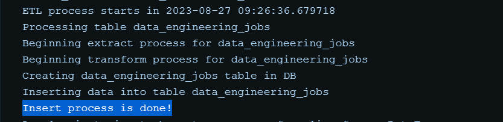
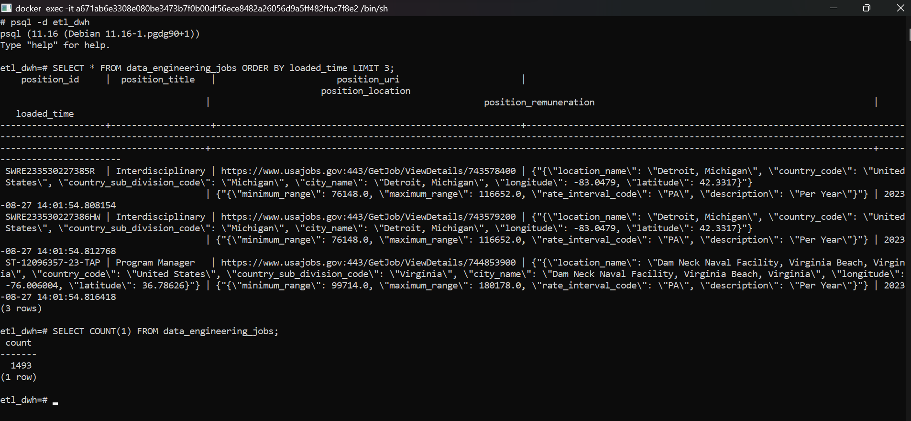

# USA Job ETL Script

Personal project to perform ETL (Extract-Transform-Load) of data from USA Job government portal. The main objective of the script is to get job data from the website and load it into our desired database. This project focuses on the search feature of the website.

The job portal itself allows its users to browse jobs based on keywords, sorts the listings based on several metrics (relevance, date posted, salary, etc), and also filter its location.

Source: https://www.usajobs.gov/

## Description
Generally, this program is divided into 3 stages: **Extract**, **Transform**, and **Load**
- *Extract* is the first step when the program gets the data from the source. It sends HTTP request to the API endpoint and processed it into JSON file. After the stage is succeed, it will store the raw data of JSON files to directory `data/{table_name}/{execution_date}/extract/`
- After that, *transform* stage happens. In this stage, the data is being standardized. It filters only relevant columns that we want to keep an eye on and could possibly perform data-cleansing to get rid of bad data. After the transformation is finished, it will store the raw data of JSON files to directory `data/{table_name}/{execution_date}/transform/`
- The last thing to do is to *load* the data into our data warehouse/analytics environment.

## Getting Started

### Stacks
- PostgreSQL as destination database.
- `pandas` for transformation tooling.
- Docker to configure build and deployment of the app locally.

### Repository structure
```bash
├── custom_transform
│   └── data_engineering_jobs.py
├── modules
│   ├── extraction.py
│   └── load.py
├── destination_config.yml
├── main.py
├── Dockerfile
├── .env
├── docker-compose.yml
├── requirements.txt
├── init_db.sql
└── .gitignore
```
Detailed explanation:
- `custom_transform/`: directory of transform logics using pandas. It is a script snippet that will be used in the *transform* stage. The advantage of having this dir is we can freely customize transform logic per table.
- `modules/extraction.py` and `modules/load.py`: defines functions that will be used during the ETL process. `extraction` focuses on API handling and transform creation, while `load` contains handler function for PostgreSQL database.
- `destination_config.yml`: contains configuration of the whole end-to-end process. The process will heavily based on this file.
- `main.py`: the main program that will be executed.
- `Dockerfile` and `docker-compose.yml`: skeleton to build and containerize the application.
- `.env` : serves as environment variable in the container. Before running the program, we need to configure it. The format follows `.env.template` file that is uploaded to git repository.

### Docker container execution
Executing this command
```
docker-compose up
```
will consecutively build db image and app image, and utilize it in container. `python3 main.py` will be executed upon completion of the containerization sequence in `Dockerfile`

After it is successfully executed, we will get this message in the log.


We can also ensure the data availability by inspecting the DB and run SELECT query.

Execute `docker exec -it {db_container_name} bash` -> `psql -d {db_name}` -> Run SELECT query


### Local execution (for development purpose)
During development, I mostly only spawn the database on docker but execute the app locally. This way, the iteration and debugging process would be faster. 

In order to do this option, we will need to change host name to `host = 'localhost'` in load.py init function (+ installing dependencies on requirements.txt and ensure the PostgreSQL DB is running).